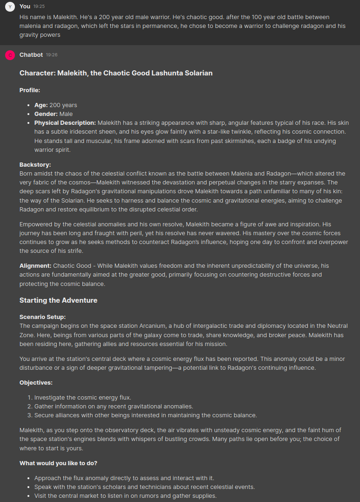

# AI Dungeon Master for Dungeons & Dragons

## Introduction
This project is an example using the Julep Platform to make an AI Dungeon Master for your Dungeons and Dragon games. Julep allows stateful interaction between the Dungeon Master and the users automatically.


By [Philip](https://github.com/philipbalbas)


## Running the project
### 1. Install the dependencies

```python
poetry install
```

### 2. Get your API key
Navigate to https://platform.julep.ai to get your API key.

Copy `.env.example` to `.env` and set the API key there.

### 3. Run the project
```bash
chainlit run app.py
```

